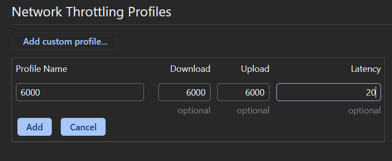

# Lecture-3

## 학습할 최적화 기법

### 이미지 지연 로딩

첫 화면에 당장 필요하지 않은 이미지가 먼저 로드되지 않도록 지연시키는 기법이다. 사용자에게 가장 먼저 보이는 콘텐츠를 더 빠르게 로드할 수 있다.

### 이미지 사이즈 최적화

서버에 저장되어 있는 정적 이미지를 사이즈를 최적화할 수 있다.

### 폰트 최적화

커스텀 폰트를 적용하려고 한다면 몇 가지 성능 문제를 야기할 수 있다.

### 캐시 최적화

자주 사용되는 리소스를 브라우저에 저장해 두고, 다음번에 사용하려고 할 때 새로 다운로드하지 않고 저장되어있는 것을 사용하는 기술이다.

### 불필요한 CSS 제거

사용하지 않는 CSS 코드가 서비스 코드에 포함되어 있는 경우 해당 코드를 제거하여 파일 사이즈를 줄일 수 있다.

## 분석 툴 소개

### 크롬 개발자 도구의 Coverage 패널

Coverage 패널은 웹 페이지를 렌더링하는 과정에서 어떤 코드가 실행되었는지 보여준다. 그리고 각 파일의 코드가 얼마나 실행되었는지 비율로 나타낸다. 퍼센티지가 낮다면 해당 파일에 불필요한 코드가 많이 포함되어 있다고 할 수 있다.

### squoosh

웹에서 서비스되는 이미지 압축 도구이다. 간편하게 이미지 포맷이나 사이즈를 변경할 수 있다.

### purgeCSS

사용하지 않는 CSS를 제거해주는 툴이다. npm에 등록되어 있으며, 직접 CLI를 통해 실행할 수 있고 webpack과 같은 번들러에서 플러그인으로 추가하여 사용할 수 있다.

## 서비스 탐색 및 코드 분석

tailwindCSS를 사용하고 있으며, 이는 CSS 유틸로 내부에 거의 모든 CSS 속성에 대한 정의를 담고 있어 매번 필요한 CSS 코드를 작성하지 않고 className만으로 편하게 스타일링 할 수 있다. npm run build:style 명령어로 tailwind.js 파일에서 정의한 설정대로 tailwind.css 파일로 새로운 css를 만들어 준다.

```jsx
const express = require("express");
const app = express();
const port = 5000;
const path = require("path");

const header = {
	setHeaders: (res, path) => {
		res.setHeader(
			"Cache-Control",
			"private, no-cache, no-store, must-revalidate"
		);
		res.setHeader("Expires", "-1");
		res.setHeader("Pragma", "no-cache");
	},
};

app.use(express.static(path.join(__dirname, "../build"), header));
app.get("*", (req, res) => {
	res.sendFile(path.join(__dirname, "../build/index.html"));
});

app.listen(port, () =>
	console.log(`Example app listening at http://localhost:${port}`)
);
```

express로 서버를 구현하고 있다. header를 설정하는 코드도 보인다.

## 이미지 지연 로딩

### 네트워크 분석

네트워크를 확인할 때는 명확한 흐름을 파악할 수 있도록 네트워크에 throttling을 적용한다. 이때 커스텀 설정을 만들 수 있다.



6000kb/s의 속도를 설정하였다.

-   fast 3g: 1500kb/s, 750kb/s
-   slow 3g: 780kb/s, 330kb/s

처음에는 당장 중요한 리소스인 bundle 파일이 다운로드 되는 것을 볼 수 있고, 이미지와 폰트가 다운로드되는 것을 확인할 수 있다.

banner-video 파일이 pending 상태로 존재하다가 일부 리소스가 다운로드 완료된 후에야 다운로드되는 것을 찾아볼 수 있다. 하지만 이 비디오는 페이지에서 가장 처음으로 사용자에게 보이는 콘텐츠인데 가장 나중에 로드되면 사용자 경험이 좋지 않을 것이다.

동영상의 다운로드를 방해하는 당장 사용되지 않는 이미지를 나중에 다운로드 되도록 하여 동영상이 먼저 다운로드되게 하면 해결할 수 있다. (이미지 지연 로드)

이미지가 화면에 보이는 순간 또는 그 직전에 이미지를 로드해야된다. 이를 구현하기 위해 Intersection Observer를 사용할 수 있다.

### Intersection Observer

이미지 지연 로딩 작업을 위해 스크롤이 이동했을 때 해당 뷰포트에 이미지를 보이게 할지 판단해야 하는데, 스크롤 이벤트에 이 로직을 넣으면 스크롤할 때마다 해당 로직이 아주 많이 실행되어 성능적으로 문제가 생길 수 있다.

요소가 화면에 들어왔을 때만 함수를 호출하므로 성능 면에서 scroll 이벤트로 판단하는 것보다 훨씬 효율적이다.

```jsx
const options = {
	root: null,
	rootMargin: "0px",
	threshold: 1.0,
};

const callback = (entries, observer) => {
	console.log("Entries", entries);
};

const observer = new IntersectionObserver(callback, options);

observer.observe(document.querySelector("#target-element1"));
observer.observe(document.querySelector("#target-element2"));
```

options는 이름 그대로 Intersection Observer의 옵션이다.

-   root: 대상 객체의 가시성을 확인할 때 사용되는 뷰 포트 요소, 기본값은 null(브라우저의 뷰포트)
-   rootMargin: root요소의 여백. root의 가시 범위를 가상으로 확장하거나 축소할 수 있음
-   threshold: 가시성 퍼센티지, 0 → 1px이라도 보이는 경우 콜백 실행 1 → 다 보여야 실행

IntersectionObserver 객체를 생성하면 인스턴스가 나오는데 이 인스턴스를 이용하여 원하는 요소를 관찰할 수 있다. 대상 요소의 가시성이 변할 때마다 콜백이 실행되며 콜백에서는 첫 번째 인자로 가시성이 변할 때마다 콜백이 실행되며 콜백에서는 첫 번째 인자로 가시성이 변한 요소를 배열 형태로 전달 받는다.

## Intersection Observer 적용하기

```jsx
import React, { useEffect, useRef } from "react";

function Card(props) {
	const imgRef = useRef(null);

	useEffect(() => {
		const options = {};
		const callback = (entries, observer) => {
			console.log(entries);
		};

		const observer = new IntersectionObserver(callback, options);
		observer.observe(imgRef.current);

		return () => observer.disconnect();
	}, []);

	return (
		<div className="Card text-center">
			
			<div className="p-5 font-semibold text-gray-700 text-xl md:text-lg lg:text-xl keep-all">
				{props.children}
			</div>
		</div>
	);
}

export default Card;
```

useEffect를 사용하지 않으면 렌더링할 때마다 인스턴스가 생성되므로 중복 방지를 위해 useEffect에 인스턴스를 생성해야 한다. 생성된 인스턴스는 clean-up 함수에서 disconnect를 호출함으로써 리소스가 낭비되지 않도록 한다.

entries 값이 배열 형태로 다양한 정보(boundingClientRect, intersectionRatio 등)을 담고 있으며, 가장 중요한 정보는 요소가 뷰포트 내에 들어왔는지를 나타내는 값인 isIntersecting이다.

화면에서 이미지가 보이는 순간, 콜백이 실행되는 순간에 이미지를 로드하는 일이다. 이미지 로딩은 img 태그에 src가 할당되는 순간 일어나므로 src값을 할당하지 않다가 콜백이 실행되는 순간 src를 할당함으로써 이미지 지연 로딩을 적용할 수 있다.

```jsx
import React, { useEffect, useRef } from "react";

function Card(props) {
	const imgRef = useRef(null);

	useEffect(() => {
		const options = {};
		const callback = (entries, observer) => {
			entries.forEach((entry) => {
				if (entry.isIntersecting) {
					console.log("is Intersecting", entry.target.dataset.src);
					entry.target.src = entry.target.dataset.src;
					observer.unobserve(entry.target);
				}
			});
		};

		const observer = new IntersectionObserver(callback, options);
		observer.observe(imgRef.current);

		return () => observer.disconnect();
	}, []);

	return (
		<div className="Card text-center">
			
			<div className="p-5 font-semibold text-gray-700 text-xl md:text-lg lg:text-xl keep-all">
				{props.children}
			</div>
		</div>
	);
}

export default Card;
```

이전과 달라진 부분

-   data-src에 이미지 주소를 넣고, intersecting 중일 때 src에 이 값을 할당해 이미지를 로드
-   observer.unobserve를 intersecting 중이면 실행해서 한번 로드한 후에는 호출하지 않도록 해제


카드 부분이 보여질 때 이미지가 불러와짐을 확인할 수 있다.

## 이미지 사이즈 최적화

### 느린 이미지 로딩 분석

이미지가 잘려 보이면 서비스가 느리다는 느낌을 줄 수 있다. Network 패널을 통해 이미지들을 살펴보면 파일 크기가 매우 큰 것을 확인할 수 있다. 따라서 이미지 사이즈를 최적화해서 성능을 높일 수 있다.

### 이미지 포맷 종류

이미지의 가로, 세로 사이즈를 줄여 이미지 용량을 줄이고, 그만큼 더 빠르게 다운로드하는 기법이다.

비트맵 이미지 포맷의 종료

-   png - 무손실 압축 방식으로 원본을 훼손 없이 압축하여 알파 채널을 지원하는 이미지 포맷.
-   jpg(jpeg) - 압축 과정에서 정보 손실이 발생. 그만큼 이미지를 더 작은 사이즈로 줄일 수 있음
-   webp - 무손실 압축과 손실 압축을 모두 제공하는 최신 이미지 포맷 png나 jpg에 비해서 효율적으로 이미지를 압축할 수 있음. 공식 문서에 따르면 png 대비 26%, jpg 대비 25~34% 더 나은 효율

하지만 webp는 지원이 되지 않는 브라우저도 있을 수 있으므로 사용에 주의해야 함

-   사이즈: PNG > JPG > WebP
-   화질: PNG = WebP > JPG
-   호환성: PNG = JPG > WebP

### Squoosh를 사용하여 이미지 변환

변환할 이미지를 squoosh에 올리면 된다. 오른쪽 하단에는 어떤 식으로 이미지를 변환할지 설정하는 옵션이 있다.

실제로 사용될 이미지 사이즈의 두 배로 리사이징을 하고 webp 포맷으로 바꾸어준다.


오.. 정말 큰 차이를 보인다. 물론 disable cache 설정을 해서 정확하게 체크한 결과물이다.

webp는 하지만 호환성의 문제가 있으므로 webp로만 이미지를 렌더링할 경우 특정 브라우저에서는 제대로 렌더링되지 않을 수도 있다.

이런 문제를 해결하려면 단순 img 태그로만 이미지를 렌더링하면 안 되며, picture 태그를 사용해야 한다. picture 태그는 다양한 타입의 이미지를 렌더링하는 컨테이너이다. 브라우저 사이즈 또는 지원되는 타입의 이미지를 찾아 렌더링한다.

```jsx
# 뷰포트에 따라 구분
<picture>
	<source media="(min-widt:650px)" srcset="img_pink_flowers.jpg">
	<source media="(min-widt:465px)" srcset="img_white_flowers.jpg">
	
</picture>

# 이미지 포맷에 따라 구분
<picture>
	<source srcset="photo.avif" type="image/avif">
	<source srcset="photo.webp" type="image/webp">
	
</picture>
```

```jsx
import React, { useEffect, useRef } from "react";

function Card(props) {
	const imgRef = useRef(null);

	useEffect(() => {
		const options = {};
		const callback = (entries, observer) => {
			entries.forEach((entry) => {
				if (entry.isIntersecting) {
					const target = entry.target;
					const previousSibling = target.previousSibling;

					console.log("is Intersecting", entry.target.dataset.src);
					target.src = target.dataset.src;
					previousSibling.srcset = previousSibling.dataset.srcset;
					observer.unobserve(entry.target);
				}
			});
		};

		const observer = new IntersectionObserver(callback, options);
		observer.observe(imgRef.current);

		return () => observer.disconnect();
	}, []);

	return (
		<div className="Card text-center">
			<picture>
				<source data-srcset={props.webp} type="image/webp" />
				
			</picture>
			<div className="p-5 font-semibold text-gray-700 text-xl md:text-lg lg:text-xl keep-all">
				{props.children}
			</div>
		</div>
	);
}

export default Card;
```

```
import React from "react";
import BannerVideo from "../components/BannerVideo";
import ThreeColumns from "../components/ThreeColumns";
import TwoColumns from "../components/TwoColumns";
import Card from "../components/Card";
import Meta from "../components/Meta";
import main1_webp from "../assets/main1.webp";
import main2_webp from "../assets/main2.webp";
import main3_webp from "../assets/main3.webp";
import main_items from "../assets/main-items.webp";
import main_parts from "../assets/main-parts.webp";
import main_styles from "../assets/main-styles.webp";
import main1 from "../assets/main1.jpg";
import main2 from "../assets/main2.jpg";
import main3 from "../assets/main3.jpg";
// import main_items from "../assets/main-items.jpg";
// import main_parts from "../assets/main-parts.jpg";
// import main_styles from "../assets/main-styles.jpg";

function MainPage(props) {
	return (
		<div className="MainPage -mt-16">
			<BannerVideo />
			<div className="mx-auto">
				<ThreeColumns
					columns={[
						<Card image={main1} webp={main1_webp}>
							롱보드는 아주 재밌습니다.
						</Card>,
						<Card image={main2} webp={main2_webp}>
							롱보드를 타면 아주 신납니다.
						</Card>,
						<Card image={main3} webp={main3_webp}>
							롱보드는 굉장히 재밌습니다.
						</Card>,
					]}
				/>
				<TwoColumns
					bgColor={"#f4f4f4"}
					columns={[
						,
						<Meta
							title={"Items"}
							content={
								"롱보드는 기본적으로 데크가 크기 때문에 입맛에 따라 정말 여러가지로 변형된 형태가 나올수 있습니다. 실제로 데크마다 가지는 모양, 재질, 무게는 천차만별인데, 본인의 라이딩 스타일에 맞춰 롱보드를 구매하시는게 좋습니다."
							}
							btnLink={"/items"}
						/>,
					]}
				/>
				<TwoColumns
					bgColor={"#fafafa"}
					columns={[
						<Meta
							title={"Parts of Longboard"}
							content={
								"롱보드는 데크, 트럭, 휠, 킹핀, 베어링 등 여러 부품들로 구성됩니다. 롱보드를 타다보면 조금씩 고장나는 부품이 있기 마련인데, 이럴때를 위해 롱보들의 부품들에 대해서 알고 있으면 큰 도움이 됩니다."
							}
							btnLink={"/part"}
						/>,
						,
					]}
					mobileReverse={true}
				/>
				<TwoColumns
					bgColor={"#f4f4f4"}
					columns={[
						,
						<Meta
							title={"Riding Styles"}
							content={
								"롱보드 라이딩 스타일에는 크게 프리스타일, 다운힐, 프리라이딩, 댄싱이 있습니다. 보통 롱보드는 라이딩 스타일에 따라 데크의 모양이 조금씩 달라집니다. 많은 롱보드 매니아들이 각 쓰임새에 맞는 보드들을 소유하고 있습니다."
							}
							btnLink={"/riding-styles"}
						/>,
					]}
				/>
			</div>
		</div>
	);
}

export default MainPage;
```

이렇게 변경해주면 webp를 우선으로 로드하고, 브라우저가 webp를 지원하지 않으면 img 태그에 있는 jpg 이미지를 렌더링한다.

지연 로딩을 하고 있기 때문에 data-srcset에 임시로 넣어주고 콜백에서 srcset으로 옮겨준다.

## 동영상 최적화

### 동영상 콘텐츠 분석

홈페이지에 쓰인 동영상을 최적화 해볼 수 있다.

동영상 파일은 이미지처럼 하나의 요청으로 모든 영상을 다운로드하지 않는다. 동영상 콘텐츠의 특성상 파일 크기가 크기 때문에 당장 재생이 필요한 앞부분을 먼저 다운로드한 뒤 순차적으로 나머지 내용을 다운로드 한다. 따라서 여러 요청이 발생하게 된다.

애초에 파일이 크다보니 동영상을 재생하기까지 꽤 오래 걸리는 것을 확인할 수 있다. performance 패널을 통해 확인해보면 일정 시간 동안 동영상 콘텐츠가 다운로드되고, 그 이후에야 재생이 되는 것을 볼 수 있다.

assets 폴더에 있는 동영상을 확인해보면 54mb나 되기 때문에 웹에서 사용하기에 너무 큰 사이즈이다. 이 콘텐츠를 최적화 해보자.

### 동영상 압축

이미지 최적화와 비슷하게 동영상의 가로, 세로 사이즈를 줄이고 압축 방식을 변경하여 동영상의 용량을 줄일 수 있다. 하지만 압축을 하게 되면 화질이 낮아질 수 있기 때문에 메인 콘텐츠라면 하지 않는 것이 좋다.

media.io라는 사이트에서 압축을 진행하였다. 확장자를 WebM으로 선택한다. WebP와 동일하게 구글에서 개발한 웹에 최적화된 포맷이다.

Audio 압축 옵션은 해제하고, Bitrate를 512kbps로 진행하였다.

### 압축된 동영상 적용

이미지 최적화에서 했던 것처럼 파일 이름에 언더바를 붙여 assets 폴더로 옮겨 준다. WebM도 WebP와 마찬가지로 호환성 문제가 있다. video 태그를 사용해서 source를 감싸주면 WebM 동영상을 지원하지 않는 브라우저에서는 그 다음 소스인 MP4 동영상으로 재생을 한다.

```jsx
<video
	className="absolute translateX--1/2 h-screen max-w-none min-w-screen -z-1 bg-black min-w-full min-h-screen"
	autoPlay
	loop
	muted>
	<source src={video_webm} type="video/webm"></source>
	<source src={video} type="video/mp4"></source>
</video>
```

### 최적화 전후 비교

performance 패널로 분석해보면 동영상이 이전과 달리 매우 빠르게 로드되고 재생되는 것을 확인할 수 있다.

### 팁

화질이 많이 저하된 것을 확인할 수 있는데 이를 보완할 수 있는 방법이 있다.

-   패턴
-   필터: ex) filter: blur(10px)

## 폰트 최적화

홈페이지에 쓰인 폰트를 최적화할 수 있다.

배너에 있는 텍스트가 보이는 시점에 폰트 다운로드가 완료되지 않아서 텍스트가 변하는 현상이 발생한다. Fast3G로 설정한 경우 무려 5.76초나 걸리는 것을 확인할 수 있다.


### FOUT, FOIT

FOUT(Flash of Unstyled Text) 또는 FOIT(Flash of Invisible Text)는 폰트의 변화로 발생하는 현상을 말한다.

-   FOUT: edge 브라우저에서 폰트를 로드하는 방식으로 먼저 텍스트를 보여준 후 폰트를 적용하는 방식
-   FOIT: 크롬, 사파리, 파이어폭스 등에서 폰트를 로드하는 방식, 폰트가 완전히 다운로드 되기 전까지 텍스트 자체를 보여주지 않음

하지만 그래도 폰트가 적용되지 않은 텍스트가 보이는 데 그 이유는 3초만 기다리는 FOIT 방식이기 때문이다.

### 폰트 최적화 방법

-   폰트 적용 시점 제어
-   폰트 사이즈 줄이기

**폰트 적용 시점 제어**

중요한 텍스트의 경우 FOIT 방식으로 폰트를 적용하기 보다 FOUT이 좋을 것이다. 뉴스와 같은 중요한 텍스트같은 경우에는 사용자에게 빨리 전달되어야 하기 때문이다. 따라서 서비스와 콘텐츠 특성에 맞게 적절한 방식을 적용해야 한다.

CSS font-display 속성으로 폰트가 적용되는 시점을 제어할 수 있다.

-   auto: 브라우저 기본 동작
-   block: FOIT (timeout=3s)
-   swap: FOUT
-   fallback: FOIT (timeout=0.1s) 3초 후 불러오지 못한 경우 기본 폰트로 유지 이후 캐시
-   optional: FOIT (timeout=0.1s) 이후 네트워크 상태에 따라 기본 폰트로 유지할지 결정, 이후 캐시

메인 텍스트는 빠르게 보여줘야 하거나 중요한 내용이 아니기 때문에 FOIT block을 사용하고, 자연스럽게 폰트가 적용된 텍스트를 보여주기 위해서 fade-in 애니메이션을 적용해볼 수 있다.

폰트가 다운로드가 완료되는 시점을 알기 위해서 fontfaceobserver 라이브러리를 사용할 수 있다.

```jsx
import React from "react";
import video_webm from "../assets/banner-video.webm";
import video from "../assets/banner-video.mp4";
import FontFaceObserver from "fontfaceobserver";
import { useEffect } from "react";
import { useState } from "react";

const font = new FontFaceObserver("BMYEONSUNG");

function BannerVideo() {
	const [isFontLoaded, setIsFontLoaded] = useState(false);
	useEffect(() => {
		font.load(null, 20000).then(function () {
			setIsFontLoaded(true);
			console.log("font has loaded");
		});
	}, []);

	return (
		<div className="BannerVideo w-full h-screen overflow-hidden relative bg-texture">
			<div className="absolute h-screen w-full left-1/2">
				<video
					className="absolute translateX--1/2 h-screen max-w-none min-w-screen -z-1 bg-black min-w-full min-h-screen"
					autoPlay
					loop
					muted>
					<source src={video_webm} type="video/webm"></source>
					<source src={video} type="video/mp4"></source>
				</video>
			</div>
			<div
				style={{
					opacity: isFontLoaded ? 1 : 0,
					transition: "opacity 0.3s ease",
				}}
				className="w-full h-full flex justify-center items-center">
				<div className="text-white text-center">
					<div className="text-6xl leading-none font-semibold">
						KEEP
					</div>
					<div className="text-6xl leading-none font-semibold">
						CALM
					</div>
					<div className="text-3xl leading-loose">AND</div>
					<div className="text-6xl leading-none font-semibold">
						RIDE
					</div>
					<div className="text-5xl leading-tight font-semibold">
						LONGBOARD
					</div>
				</div>
			</div>
		</div>
	);
}

export default BannerVideo;
```

폰트 로드 시점을 알아내어서 배너 텍스트에 페이드 인 효과를 적용했다. 단순이 텍스트를 빠르게 띄우는 것도 좋지만, 사용자에게 보기 편하게 체감 성능을 높이는 것도 중요하다.

**폰트 파일 크기 줄이기**

1. 압축률이 좋은 폰트 포맷을 사용
2. 필요한 문자의 폰트만 로드

**폰트 포맷 변경하기**

파일 크기 : EOT > TTF/OTF > WOFF > WOFF2

TTF는 매우 크기가 크다. 웹 환경에서는 적절하지 않다 따라서 웹을 위한 폰트인 WOFF를 사용하는 것이 좋다. TTF 폰트를 압축하여 웹에서 더욱 빠르게 로드할 수 있게 만든 것이다.

WOFF, WOFF2에도 브라우저 호환성 문제가 있을 수 있다. 모던 브라우저에서는 정상적으로 사용ㅎ라 수 있지만, 버전이 낮은 일부 브라우저에서 해당 포맷을 지원하지 않을 수 있다.
transfonter라는 서비스에서 woff, woff2로 변환하였다.


```css
@font-face {
	font-family: BMYEONSUNG;
	src: url("./assets/fonts/BMYEONSUNG.woff2") format("woff2") url("./assets/fonts/BMYEONSUNG.woff")
		format("woff") url("./assets/fonts/BMYEONSUNG.ttf") format("truetype");
	font-display: block;
}
```


ttf로 불러올 때보다 더 빠르게 다운로드 됨을 확인할 수 있다.

**서브셋 폰트 사용**

포맷을 변경하여 파일 크기를 줄여봤지만 447kb는 여전히 너무 크다. 모든 문자가 아닌 일부 문자의 폰트 정보만 가지고 있는 것을 서브셋 폰트라고 한다.


훨씬 파일 용량이 줄어들고 빨리 로드됨을 확인할 수 있다.

Data-URI 형태로도 CSS 파일에 포함할 수 있다. data 스킴이 붙은 문자열 형태의 데이터로, 별도의 네트워크 로드 없이 App.css 파일에서 폰트를 사용할 수 있다. 하지만 App.css 파일에 포함된 것이므로, App.css 다운로드 속도 또한 고려해야 한다. Data-URI가 포함된 만큼 App.css 다운로드가 느려져서 또 다른 병목이 될 수 있음에 유의 한다.

## 캐시 최적화

이때까지 한 것을 lighthouse로 측정하면 점수가 좋게 나오는 것을 확인할 수 있다. Diagnostics 섹션의 Serve static assets with an efficient cache policy라고 적혀있는 것을 볼 수 있다. 리소스에 캐시를 적용하라는 의미이다.


### 캐시란?

자주 사용하는 데이터나 값을 미리 복사해둔 임시 저장 공간 또는 저장하는 동작이다. 최초에만 리소스를 다운로드하여 캐시에 저장하고, 이후 요청에는 저장해둔 파일을 사용한다.

**캐시의 종류**

-   메모리 캐시 - 메모리에 저장하는 방식 RAM을 의미
-   디스크 캐시 - 파일 형태로 디스크에 저장하는 방식

단순 새로고침 memory cache가 많고 브라우저 완전히 종료 후에는 disk cache가 많을 것이다.

어떤 캐시를 사용할지는 직접 제어할 수 없고 브라우저가 사용빈도나 크기에 따라 특정 알고리즘으로 처리한다. Network 패널을 확인해보면 Size 항목에 memory cache 또는 disk cache라고 표시된 것을 확인할 수 있다. Cache-Control 헤더가 응답 헤더에 포함되어있는데, 이 헤더는 서버에서 설정되며, 이를 통해 브라우저는 해당 리소스를 얼마나 캐시할지 판단한다.

### Cache-Control

리소스의 응답 헤더에 설정되는 헤더이다.

-   no-cache: 캐시를 사용하기 전 서버에 검사 후 사용
-   no-store: 캐시 사용 안함
-   public: 모든 환경에서 캐시 사용 가능
-   private: 브라우저 환경에서만 캐시 사용, 외부 캐시 서버에서는 사용 불가
-   max-age: 캐시의 유효 기간

public과 private의 차이는 캐시 환경에 있다. 웹 리소스는 브라우저뿐만 아니라 웹 서버와 브라우저 사이를 연결하는 중간 캐시 서버에서도 캐시될 수 있다. 중간 서버에서 캐시를 적용하고 싶지 않으면 private 옵션을 사용한다.

-   Cache-Control: max-age=60
    -   60초 동안 캐시를 사용함. private 옵션이 없으므로 public으로 설정되어 모든 환경에서 캐시를 함
-   Cache-Control: private, max-age=60
    -   브라우저 환경에서만 600초 동안 캐시 사용
-   Cache-Control: public, max-age=0
    -   모든 환경에서 0초 동안 캐시 사용, no-cache와 동일한 설정임 (매번 서버에 캐시 사용을 물어봄)

### 캐시 적용

노드 서버 파일에서 헤더를 수정한 후, 빌드하고 서버를 띄워본다.

```jsx
const header = {
	setHeaders: (res, path) => {
		res.setHeader("Cache-Control", "max-age=10");
	},
};
```

리소스들이 캐시되는 것을 확인할 수 있다. 설정 기간인 10초가 지난 후 새로고침 해보면 조금 다르게 불러옴을 확인할 수 있다. 캐시 유효 시간이 만료되면서 브라우저가 서버에 기존 캐시 리소스를 사용해도 될지 또는 새로 다운로드해야 할 지 서버에 확인하기 떄문이다. 이때 서버에서는 캐시된 리소스의 응답 헤더에 있는 Etage 값과 서버에 있는 최신 리소스의 Etag 값을 비교하여 판단한다. 같은 경우, 서버에서는 캐시를 그대로 사용해도 됨을 304 Not Modified 코드를 응답으로 보낸다.


### 적절한 캐시 유효 시간

HTML - no-cache: 항상 최신 버전의 웹서비스 제공

JS - public, max-age=3156000

CSS - public, max-age=3156000

IMG - public, max-age=3156000 (1년)

빌드된 자바스크립트와 CSS는 파일명에 해시를 가지게 하였으므로 완전 다른 파일이 되어있다. HTML이 최신 상태라면 당연히 최신 리소스를 로드할 것이다.

```jsx
const header = {
	setHeaders: (res, path) => {
		if (path.endsWith(".html")) {
			res.setHeader("Cache-Control", "no-cache");
		} else if (
			path.endsWith(".js") ||
			path.endsWith(".css") ||
			path.endsWith(".webp")
		) {
			res.setHeader("Cache-Control", "public, max-age=31536000");
		} else {
			res.setHeader("Cache-Control", "no-store");
		}
	},
};
```

이런 식으로 확장자에 따라 헤더를 다르게 적용할 수 있다.

## 불필요한 CSS 제거

light house 항목에 Reduce unused CSS 항목이 있음을 확인할 수 있다. Coverage 패널에서는 js, css 리소스에서 실제로 실행하는 코드가 얼마나 되는지 알려 주며 그 비율을 표시해준다.


오른쪽 사용하지 않는 바이트와 사용량 시각화 항목에서 비율로 확인할 수 있다. 자바스크립트 같은 경우에는 if문 같은 조건이 걸려있어 어느 정도 감안해야 한다.

CSS 리소스를 확인해봤을 때 사용하지 않는 코드가 무려 99%라고 한다. 이는 tailwindCSS 라이브러리에서 추가된 것으로 쉽고 빠르게 스타일을 적용할 수 있다는 장점이 있지만 빌드하고 나니 파일 사이즈를 크게 만드는 단점이 있다.

### PurgeCSS

purgeCSS 툴을 사용해 해결한다.

```bash
$ purgecss --css ./build/css/*.css --output ./build/static/css/ --content ./build/index.html ./build/static/js/*.js
```

키워드를 추출하고자 하는 파일과 불필요한 클래스를 제거할 CSS 파일을 지정하면 된다.

npx를 사용하거나 package.json의 purge 스크립트를 만든다.

```json
"scripts": {
		"start": "npm run build:style && react-scripts start",
		"build": "npm run build:style && react-scripts build",
		"build:style": "postcss src/tailwind.css -o src/styles.css",
		"serve": "node ./server/server.js",
		"server": "node ./node_modules/json-server/lib/cli/bin.js --watch ./server/database.json -c ./server/config.json",
		"purge": "purgecss --css ./build/static/css/*.css --output ./build/static/css/ --content ./build/index.html ./build/static/js/*.js"
	},
```


purge를 하고 다시 서버를 띄우면 55.9%로 퍼센티지가 많이 낮아졌음을 확인할 수 있다.

하지만 일부 스타일이 제대로 정의되어 있지 않다. 이는 텍스트 키워드를 추출할 때 콜론 문자를 하나의 키워드로 인식하지 못하고 잘라버렸기 떄문이다. 이를 해결하기 위해 purgeCSS의 defaultExtractor 옵션을 통해 해결한다. 밑줄과 콜론 하이픈 키워드를 살리게끔 해둔다.

```jsx
module.exports = {
	defaultExtractor: (content) => content.match(/[\w\:\-]+/g) || [],
};
```

```json
"scripts": {
		"start": "npm run build:style && react-scripts start",
		"build": "npm run build:style && react-scripts build",
		"build:style": "postcss src/tailwind.css -o src/styles.css",
		"serve": "node ./server/server.js",
		"server": "node ./node_modules/json-server/lib/cli/bin.js --watch ./server/database.json -c ./server/config.json",
		"purge": "purgecss --css ./build/static/css/*.css --output ./build/static/css/ --content ./build/index.html ./build/static/js/*.js --config ./purgecss.config.js"
	},
```

스크립트도 변경한다. 다시 빌드 후 purge를 수행하면 스타일도 제대로 적용되고, coverage도 이전에 비해 낮아진 것을 확인할 수 있다.
